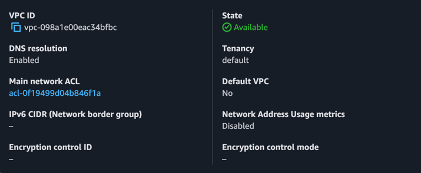
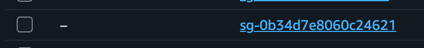
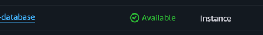

# Лабораторная работа №5. Облачные базы данных. Amazon RDS, DynamoDB

## Описание лабораторной работы

Данная лабораторная работа посвящена изучению сервисов Amazon RDS и Amazon DynamoDB. В ходе работы была создана реляционная база данных MySQL в облаке AWS, настроены Read Replicas, выполнены базовые операции CRUD, а также (дополнительно) реализована интеграция с Amazon DynamoDB.

---

## Постановка задачи

- Создать VPC с публичными и приватными подсетями
- Настроить группы безопасности для приложения и базы данных
- Развернуть экземпляр Amazon RDS (MySQL 8.0)
- Подключиться с EC2 и выполнить операции CRUD
- Создать Read Replica и проверить репликацию
- Развернуть веб-приложение с подключением к RDS
- (Доп.) Создать и интегрировать таблицу Amazon DynamoDB

---

## Цель и основные этапы работы

**Цель:** освоить работу с управляемыми базами данных в AWS, понять принципы репликации данных и разделения нагрузки на чтение/запись.

**Этапы:**
1. Подготовка среды (VPC, подсети, Security Groups)
2. Развёртывание Amazon RDS
3. Создание EC2-машины для подключения к БД
4. Выполнение базовых операций с данными (CRUD)
5. Создание Read Replica и проверка репликации
6. Развёртывание веб-приложения
7. (Доп.) Работа с Amazon DynamoDB

---

## Практическая часть

### Шаг 1. Подготовка среды (VPC / подсети / Security Groups)

Создан VPC `project-vpc` с CIDR `10.0.0.0/16`, содержащий:
- 2 публичные подсети: `10.0.1.0/24` (us-east-1a), `10.0.2.0/24` (us-east-1b)
- 2 приватные подсети: `10.0.3.0/24` (us-east-1a), `10.0.4.0/24` (us-east-1b)

> 

**Security Group `web-security-group`:**

| Направление | Протокол | Порт | Источник |
|-------------|----------|------|----------|
| Входящий | TCP | 80 (HTTP) | 0.0.0.0/0 |
| Входящий | TCP | 22 (SSH) | 0.0.0.0/0 |
| Исходящий | TCP | 3306 (MySQL) | db-mysql-security-group |

**Security Group `db-mysql-security-group`:**

| Направление | Протокол | Порт | Источник |
|-------------|----------|------|----------|
| Входящий | TCP | 3306 (MySQL) | web-security-group |

> 

---

### Шаг 2. Развёртывание Amazon RDS

#### Что такое Subnet Group и зачем он нужен?

**Subnet Group** (группа подсетей) — это набор подсетей в разных зонах доступности (AZ), из которых Amazon RDS будет выбирать, где разместить экземпляр базы данных.

**Зачем необходим Subnet Group:**
- RDS размещается только в приватных подсетях (без прямого доступа из интернета) — Subnet Group явно указывает, какие подсети допустимы
- При Multi-AZ развёртывании RDS автоматически создаёт резервный экземпляр в другой AZ — для этого группа должна охватывать несколько AZ
- Это обязательное требование при создании RDS внутри VPC

Создан Subnet Group `project-rds-subnet-group`, включающий приватные подсети `10.0.3.0/24` и `10.0.4.0/24` из двух разных AZ.

**Параметры созданного экземпляра RDS:**

| Параметр | Значение |
|----------|----------|
| Engine | MySQL 8.0.42 |
| Template | Free Tier |
| Identifier | project-rds-mysql-prod |
| Master username | admin |
| Instance class | db.t3.micro |
| Storage | 20 GB gp3, autoscaling до 100 GB |
| Public access | No |
| VPC | project-vpc |
| Security Group | db-mysql-security-group |
| Initial DB name | project_db |

> 📸

**Endpoint базы данных:**
```
project-rds-mysql-prod.xxxxxxxxxx.us-east-1.rds.amazonaws.com
```

---

### Шаг 3. Создание виртуальной машины EC2

Создана EC2-машина в публичной подсети `10.0.1.0/24`:

| Параметр | Значение |
|----------|----------|
| AMI | Amazon Linux 2023 |
| Instance type | t2.micro |
| Subnet | Публичная (us-east-1a) |
| Security Group | web-security-group |
| Auto-assign Public IP | Enabled |

**User Data (установка MySQL-клиента при запуске):**
```bash
#!/bin/bash
dnf update -y
dnf install -y mariadb105
```

---

### Шаг 4. Подключение к БД и выполнение CRUD-операций

**Подключение к EC2 по SSH:**
```bash
ssh -i my-key.pem ec2-user@<EC2_PUBLIC_IP>
```

**Подключение к RDS:**
```bash
mysql -h project-rds-mysql-prod.xxxxxxxxxx.us-east-1.rds.amazonaws.com -u admin -p
```

**Выбор базы данных:**
```sql
USE project_db;
```

**Создание таблиц (связь 1 ко многим):**
```sql
CREATE TABLE categories (
    id INT AUTO_INCREMENT PRIMARY KEY,
    name VARCHAR(100) NOT NULL
);

CREATE TABLE todos (
    id INT AUTO_INCREMENT PRIMARY KEY,
    title VARCHAR(255) NOT NULL,
    status ENUM('pending', 'in_progress', 'done') DEFAULT 'pending',
    category_id INT NOT NULL,
    created_at TIMESTAMP DEFAULT CURRENT_TIMESTAMP,
    FOREIGN KEY (category_id) REFERENCES categories(id) ON DELETE CASCADE
);
```

**Вставка записей:**
```sql
INSERT INTO categories (name) VALUES ('Work'), ('Personal'), ('Shopping');

INSERT INTO todos (title, status, category_id) VALUES
    ('Prepare presentation', 'in_progress', 1),
    ('Send weekly report', 'pending', 1),
    ('Review pull requests', 'done', 1),
    ('Buy groceries', 'pending', 3),
    ('Call dentist', 'pending', 2),
    ('Read book chapter', 'done', 2);
```

**Запросы SELECT с JOIN:**
```sql
-- Все задачи с названием категории
SELECT t.id, t.title, t.status, c.name AS category
FROM todos t
JOIN categories c ON t.category_id = c.id;

-- Количество задач по категориям
SELECT c.name, COUNT(t.id) AS task_count
FROM categories c
LEFT JOIN todos t ON c.id = t.category_id
GROUP BY c.name;

-- Незавершённые задачи
SELECT t.title, c.name AS category
FROM todos t
JOIN categories c ON t.category_id = c.id
WHERE t.status != 'done';
```
---

### Шаг 5. Создание Read Replica

**Параметры Read Replica:**

| Параметр | Значение |
|----------|----------|
| Identifier | project-rds-mysql-read-replica |
| Instance class | db.t3.micro |
| Storage | gp3 |
| Public access | No |
| Security Group | db-mysql-security-group |

**Endpoint Read Replica:**
```
project-rds-mysql-read-replica.xxxxxxxxxx.us-east-1.rds.amazonaws.com
```

**Подключение к Read Replica:**
```bash
mysql -h project-rds-mysql-read-replica.xxxxxxxxxx.us-east-1.rds.amazonaws.com -u admin -p
```

---

#### Контрольный вопрос: Какие данные видны на Read Replica?

На Read Replica отображаются **все те же данные**, что и на основном экземпляре — таблицы `categories` и `todos` со всеми вставленными записями.

**Почему:** Read Replica синхронизируется с основным экземпляром через **асинхронную репликацию** (binary log replication). Все транзакции с мастера автоматически применяются к реплике, поэтому данные идентичны (с небольшой задержкой — replica lag).

---

#### Контрольный вопрос: Получилось ли выполнить запись на Read Replica?

**Нет.** При попытке выполнить `INSERT` на реплике возникает ошибка:

```
ERROR 1290 (HY000): The MySQL server is running with the --read-only option
so it cannot execute this statement
```

**Почему:** Read Replica работает в режиме `read_only=ON`. Это ключевой принцип — реплика предназначена **только для чтения**. Попытка записи нарушила бы согласованность данных, так как мастер является единственным источником истины (source of truth).

---

#### Контрольный вопрос: Отобразилась ли новая запись на реплике?

**Да.** После добавления на мастере новой записи:
```sql
INSERT INTO todos (title, status, category_id) VALUES ('Test replication', 'pending', 1);
```

Через несколько секунд она появилась на реплике при выполнении `SELECT`.

**Почему:** Благодаря бинарной репликации (binlog) все изменения с мастера автоматически и асинхронно передаются на реплику. Задержка (replica lag) обычно составляет миллисекунды при нормальной нагрузке.

---

#### Зачем нужны Read Replicas?

**Read Replicas решают несколько задач:**

1. **Масштабирование чтения** — при высокой нагрузке SELECT-запросы распределяются между несколькими репликами, снижая нагрузку на мастер
2. **Аналитические запросы** — тяжёлые отчётные запросы выполняются на реплике, не замедляя производительность основного экземпляра
3. **Географическое распределение** — реплики можно создавать в других регионах AWS для уменьшения latency для пользователей
4. **Disaster Recovery** — реплику можно быстро "промотировать" до мастера в случае отказа основного экземпляра
5. **Тестирование** — реплика позволяет безопасно тестировать запросы на актуальных данных

---

### Шаг 6. Развёртывание веб-приложения

Реализовано простое веб-приложение на **Python (Flask)**, выполняющее CRUD-операции. Операции записи направляются на мастер RDS, чтения — на Read Replica.

**Установка зависимостей на EC2:**
```bash
dnf install -y python3 python3-pip
pip3 install flask flask-mysqldb
```

**Структура приложения:**
```
app/
├── app.py          # Основной файл Flask
├── config.py       # Конфигурация подключения к БД
└── templates/
    └── index.html  # Шаблон страницы
```

**`config.py`:**
```python
# Мастер (для записи)
DB_MASTER = {
    'host': 'project-rds-mysql-prod.xxxxxxxxxx.us-east-1.rds.amazonaws.com',
    'user': 'admin',
    'password': 'YOUR_PASSWORD',
    'db': 'project_db'
}

# Реплика (для чтения)
DB_REPLICA = {
    'host': 'project-rds-mysql-read-replica.xxxxxxxxxx.us-east-1.rds.amazonaws.com',
    'user': 'admin',
    'password': 'YOUR_PASSWORD',
    'db': 'project_db'
}
```

**`app.py` (основные маршруты):**
```python
from flask import Flask, request, jsonify
import MySQLdb
from config import DB_MASTER, DB_REPLICA

app = Flask(__name__)

def get_conn(cfg):
    return MySQLdb.connect(**cfg)

# READ — через реплику
@app.route('/todos', methods=['GET'])
def get_todos():
    conn = get_conn(DB_REPLICA)
    cur = conn.cursor()
    cur.execute("""
        SELECT t.id, t.title, t.status, c.name
        FROM todos t JOIN categories c ON t.category_id = c.id
    """)
    rows = cur.fetchall()
    conn.close()
    return jsonify([{'id': r[0], 'title': r[1], 'status': r[2], 'category': r[3]} for r in rows])

# CREATE — через мастер
@app.route('/todos', methods=['POST'])
def create_todo():
    data = request.json
    conn = get_conn(DB_MASTER)
    cur = conn.cursor()
    cur.execute(
        "INSERT INTO todos (title, status, category_id) VALUES (%s, %s, %s)",
        (data['title'], data.get('status', 'pending'), data['category_id'])
    )
    conn.commit()
    conn.close()
    return jsonify({'id': cur.lastrowid}), 201

# UPDATE — через мастер
@app.route('/todos/<int:todo_id>', methods=['PUT'])
def update_todo(todo_id):
    data = request.json
    conn = get_conn(DB_MASTER)
    cur = conn.cursor()
    cur.execute(
        "UPDATE todos SET status=%s WHERE id=%s",
        (data['status'], todo_id)
    )
    conn.commit()
    conn.close()
    return jsonify({'updated': cur.rowcount})

# DELETE — через мастер
@app.route('/todos/<int:todo_id>', methods=['DELETE'])
def delete_todo(todo_id):
    conn = get_conn(DB_MASTER)
    cur = conn.cursor()
    cur.execute("DELETE FROM todos WHERE id=%s", (todo_id,))
    conn.commit()
    conn.close()
    return jsonify({'deleted': cur.rowcount})

if __name__ == '__main__':
    app.run(host='0.0.0.0', port=80)
```

**Запуск приложения:**
```bash
sudo python3 app.py
```

---

### Шаг 7 (Дополнительно). Использование Amazon DynamoDB

#### Проектирование таблицы

Создана таблица `Todos` в Amazon DynamoDB для хранения задач:

| Атрибут | Тип | Роль |
|---------|-----|------|
| `user_id` | String | **Partition Key (PK)** |
| `todo_id` | String | **Sort Key (SK)** |
| `title` | String | Атрибут |
| `status` | String | Атрибут |
| `category` | String | Атрибут |
| `created_at` | String | Атрибут |

**Обоснование выбора ключей:**
- **Partition Key = `user_id`** — обеспечивает группировку задач по пользователю; позволяет эффективно делать запросы всех задач конкретного пользователя
- **Sort Key = `todo_id`** (UUID) — гарантирует уникальность каждой задачи в рамках пользователя; позволяет сортировать и фильтровать задачи

#### Добавление записей (AWS CLI):
```bash
aws dynamodb put-item --table-name Todos --item '{
    "user_id": {"S": "user-001"},
    "todo_id": {"S": "todo-aaa-111"},
    "title": {"S": "Learn DynamoDB"},
    "status": {"S": "in_progress"},
    "category": {"S": "Work"}
}'

aws dynamodb put-item --table-name Todos --item '{
    "user_id": {"S": "user-001"},
    "todo_id": {"S": "todo-bbb-222"},
    "title": {"S": "Buy milk"},
    "status": {"S": "pending"},
    "category": {"S": "Shopping"}
}'
```

---

#### Преимущества и недостатки DynamoDB vs RDS

| | Amazon RDS (MySQL) | Amazon DynamoDB |
|---|---|---|
| **Модель данных** | Реляционная (таблицы, SQL) | Key-Value / Document (JSON) |
| **Масштабирование** | Вертикальное (+ Read Replicas) | Горизонтальное (автоматически) |
| **Производительность** | Зависит от размера инстанса | Стабильная при любом масштабе |
| **JOIN и сложные запросы** | ✅ Полная поддержка SQL | ❌ Нет JOIN; нужно денормализовать |
| **Схема данных** | Жёсткая схема | Гибкая (schemaless) |
| **Транзакции** | ACID-транзакции | ACID на уровне элемента (TransactWrite) |
| **Стоимость** | Почасовая оплата инстанса | Оплата за запросы и хранение |
| **Управление** | Требует настройки | Полностью serverless |

**В данном проекте DynamoDB имеет преимущества** при хранении задач с гибкими атрибутами (разные задачи могут иметь разные поля) и при необходимости масштабирования без управления сервером.

---

#### Интеграция DynamoDB в приложение (Python boto3)

```python
import boto3
import uuid
from datetime import datetime

dynamodb = boto3.resource('dynamodb', region_name='us-east-1')
table = dynamodb.Table('Todos')

# CREATE
def create_dynamo_todo(user_id, title, category):
    table.put_item(Item={
        'user_id': user_id,
        'todo_id': str(uuid.uuid4()),
        'title': title,
        'status': 'pending',
        'category': category,
        'created_at': datetime.utcnow().isoformat()
    })

# READ
def get_user_todos(user_id):
    response = table.query(
        KeyConditionExpression='user_id = :uid',
        ExpressionAttributeValues={':uid': user_id}
    )
    return response['Items']

# UPDATE
def update_dynamo_status(user_id, todo_id, new_status):
    table.update_item(
        Key={'user_id': user_id, 'todo_id': todo_id},
        UpdateExpression='SET #s = :val',
        ExpressionAttributeNames={'#s': 'status'},
        ExpressionAttributeValues={':val': new_status}
    )

# DELETE
def delete_dynamo_todo(user_id, todo_id):
    table.delete_item(Key={'user_id': user_id, 'todo_id': todo_id})
```

---

#### Сложности при проектировании данных для DynamoDB

1. **Отсутствие JOIN** — в реляционной модели связь `todos → categories` решается через внешний ключ. В DynamoDB это потребовало **денормализации**: категория хранится прямо в элементе задачи (строкой), а не как отдельная связанная таблица
2. **Планирование паттернов доступа заранее** — в SQL можно писать произвольные запросы. В DynamoDB структура ключей должна отражать наиболее частые запросы ещё на этапе проектирования
3. **Нет агрегаций** — подсчёт задач по статусу (`GROUP BY status`) требует либо дополнительного GSI (Global Secondary Index), либо обработки на стороне приложения
4. **Ограниченная фильтрация** — `FilterExpression` в DynamoDB работает **после** чтения данных, что неэффективно при большом объёме

---

#### Сценарий совместного использования RDS и DynamoDB

**Сценарий: платформа управления проектами (SaaS)**

- **Amazon RDS (MySQL)** хранит:
    - Пользователей и их роли (строгая схема, ACID-транзакции)
    - Финансовые операции и подписки (нужна целостность данных)
    - Связи между проектами, командами и пользователями (JOIN-запросы)

- **Amazon DynamoDB** хранит:
    - Задачи пользователей (гибкая схема, высокая частота запросов)
    - Уведомления и события активности (высокая скорость записи)
    - Пользовательские настройки и предпочтения (key-value доступ)

**Почему совместное использование оправдано:**
- RDS даёт мощный SQL для сложных отчётов и бизнес-логики
- DynamoDB обеспечивает масштабируемость и низкую latency для операций реального времени
- Каждая СУБД используется там, где она наиболее эффективна
- Снижение стоимости: задачи с высоким RPS в DynamoDB дешевле, чем масштабирование RDS под ту же нагрузку

---

## Список использованных источников

1. [AWS Documentation: Amazon RDS](https://docs.aws.amazon.com/rds/)
2. [AWS Documentation: Amazon DynamoDB](https://docs.aws.amazon.com/dynamodb/)
3. [AWS RDS Read Replicas](https://docs.aws.amazon.com/AmazonRDS/latest/UserGuide/USER_ReadRepl.html)
4. [DynamoDB Best Practices](https://docs.aws.amazon.com/amazondynamodb/latest/developerguide/best-practices.html)
5. [Flask Documentation](https://flask.palletsprojects.com/)
6. [boto3 DynamoDB Documentation](https://boto3.amazonaws.com/v1/documentation/api/latest/guide/dynamodb.html)

---

## Вывод

В ходе лабораторной работы были освоены ключевые возможности облачных баз данных AWS:

- **Amazon RDS** позволяет развернуть полностью управляемую реляционную СУБД (MySQL) с автоматическими резервными копиями, мониторингом и масштабированием хранилища — без необходимости администрировать сервер
- **Read Replicas** эффективно решают задачу масштабирования нагрузки на чтение: SELECT-запросы направляются на реплику, разгружая мастер для операций записи
- **Amazon DynamoDB** предоставляет serverless NoSQL-решение с автоматическим масштабированием, идеальное для неструктурированных данных и высоконагруженных сценариев
- Совместное использование RDS и DynamoDB в одном приложении позволяет применять каждую технологию там, где она наиболее эффективна: реляционные данные и сложная бизнес-логика — в RDS, высокоскоростные операции с гибкой схемой — в DynamoDB