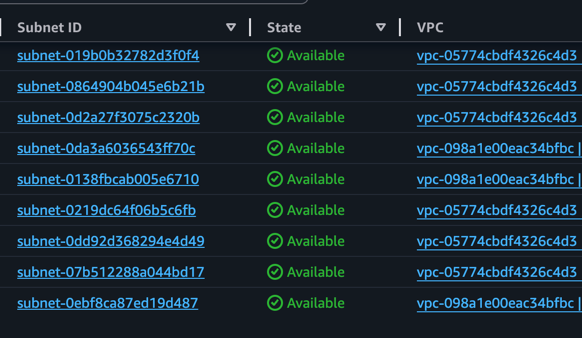

# Лабораторная работа №6. Балансирование нагрузки в облаке и авто-масштабирование

## Описание лабораторной работы

В данной лабораторной работе реализована отказоустойчивая и автоматически масштабируемая архитектура на базе AWS. Развёрнуты: VPC с публичными и приватными подсетями, веб-сервер nginx на EC2, Application Load Balancer, Auto Scaling Group и нагрузочное тестирование с мониторингом через CloudWatch.

---

## Постановка задачи

- Создать VPC с публичными и приватными подсетями в двух AZ
- Развернуть EC2-инстанс с nginx через User Data
- Создать AMI на основе настроенной машины
- Настроить Launch Template, Target Group и Application Load Balancer
- Создать Auto Scaling Group с политикой масштабирования по CPU
- Провести нагрузочный тест и наблюдать автоматическое масштабирование

---

## Цель и основные этапы работы

**Цель:** освоить построение отказоустойчивой и масштабируемой инфраструктуры в AWS с использованием ELB и Auto Scaling.

**Этапы:**
1. Создание VPC и подсетей
2. Запуск и настройка EC2 с nginx
3. Создание AMI
4. Создание Launch Template
5. Создание Target Group
6. Создание Application Load Balancer
7. Создание Auto Scaling Group
8. Тестирование Load Balancer
9. Нагрузочный тест и проверка Auto Scaling
10. Очистка ресурсов

---

## Практическая часть

### Шаг 1. Создание VPC и подсетей

Создан VPC `project-vpc` с CIDR `10.0.0.0/16`.

**Подсети:**

| Имя | CIDR | Тип | AZ |
|-----|------|-----|----|
| public-subnet-1 | 10.0.1.0/24 | Публичная | us-east-1a |
| public-subnet-2 | 10.0.2.0/24 | Публичная | us-east-1b |
| private-subnet-1 | 10.0.3.0/24 | Приватная | us-east-1a |
| private-subnet-2 | 10.0.4.0/24 | Приватная | us-east-1b |

Создан Internet Gateway `project-igw` и прикреплён к VPC. В таблице маршрутизации публичных подсетей добавлен маршрут:

```
Destination: 0.0.0.0/0 → Target: project-igw
```



---

### Шаг 2. Создание и настройка виртуальной машины

**Параметры EC2:**

| Параметр | Значение        |
|----------|-----------------|
| AMI | Amazon Linux 2  |
| Instance type | t3.nano         |
| Subnet | public-subnet-1 |
| Auto-assign Public IP | Enabled         |
| CloudWatch detailed monitoring | Enabled         |

**Security Group `web-sg`:**

| Направление | Протокол | Порт | Источник |
|-------------|----------|------|----------|
| Входящий | TCP | 22 (SSH) | My IP |
| Входящий | TCP | 80 (HTTP) | 0.0.0.0/0 |
| Исходящий | All | All | 0.0.0.0/0 |

**User Data скрипт `init.sh`:**

```bash
#!/bin/bash
yum update -y
yum install -y nginx

# Создание кастомной страницы с IP-адресом инстанса
INSTANCE_IP=$(curl -s http://169.254.169.254/latest/meta-data/local-ipv4)
INSTANCE_ID=$(curl -s http://169.254.169.254/latest/meta-data/instance-id)

cat > /usr/share/nginx/html/index.html << EOF
<!DOCTYPE html>
<html>
<head><title>Web Server</title></head>
<body>
  <h1>Hello from AWS!</h1>
  <p>Instance ID: ${INSTANCE_ID}</p>
  <p>Private IP: ${INSTANCE_IP}</p>
</body>
</html>
EOF

# Эндпоинт для нагрузочного теста
cat > /etc/nginx/conf.d/load.conf << 'EOF'
server {
    listen 80;
    location /load {
        content_by_lua_block {
            local seconds = tonumber(ngx.var.arg_seconds) or 10
            local t = os.time()
            while os.time() - t < seconds do
                local x = 0
                for i = 1, 1000000 do x = x + i end
            end
            ngx.say("Done")
        }
    }
}
EOF

# Альтернативный /load через CGI (без Lua)
cat > /usr/share/nginx/html/load.sh << 'SCRIPT'
#!/bin/bash
seconds=${QUERY_STRING#*seconds=}
seconds=${seconds%%&*}
seconds=${seconds:-10}
end=$((SECONDS + seconds))
while [ $SECONDS -lt $end ]; do
    for i in $(seq 1 100000); do echo -n > /dev/null; done
done
echo "Content-type: text/plain"
echo ""
echo "CPU load done for ${seconds}s"
SCRIPT

systemctl enable nginx
systemctl start nginx
```


---

### Шаг 3. Создание AMI

Создан образ машины: **Actions → Image and templates → Create image**

| Параметр | Значение |
|----------|----------|
| Image name | project-web-server-ami |
| No reboot | Unchecked |

---

#### Контрольный вопрос: Что такое AMI и чем он отличается от Snapshot?

**AMI (Amazon Machine Image)** — это полный образ виртуальной машины, включающий:
- Операционную систему
- Установленное ПО и конфигурации
- Одну или несколько ссылок на EBS Snapshots (данные дисков)
- Метаданные о разделах и правах запуска

**EBS Snapshot** — это резервная копия только одного тома (диска) EBS в конкретный момент времени. Snapshot хранит данные диска, но не содержит информации о том, как запустить инстанс.

**Ключевые отличия:**

| | AMI | Snapshot |
|--|-----|----------|
| Что содержит | ОС + ПО + конфиг + ссылки на снимки | Только данные одного диска |
| Можно запустить инстанс | ✅ Да | ❌ Нет (только через AMI) |
| Из чего состоит | Манифест + один или несколько Snapshot-ов | Инкрементальная копия блоков EBS |
| Применение | Создание новых инстансов (Auto Scaling) | Резервное копирование данных |

**Варианты использования AMI:**
1. **Auto Scaling** — запуск идентичных инстансов по шаблону
2. **Disaster Recovery** — быстрое восстановление из золотого образа
3. **Кросс-региональное копирование** — деплой одинаковой конфигурации в нескольких регионах
4. **Окружения** — отдельные AMI для dev/staging/prod
5. **Маркетплейс** — публикация готовых образов в AWS Marketplace

---

### Шаг 4. Создание Launch Template

| Параметр | Значение |
|----------|----------|
| Название | project-launch-template |
| AMI | project-web-server-ami |
| Instance type | t3.micro |
| Security Group | web-sg |
| CloudWatch detailed monitoring | Enabled |

---

#### Контрольный вопрос: Что такое Launch Template и чем он отличается от Launch Configuration?

**Launch Template** — это шаблон конфигурации, по которому Auto Scaling Group запускает новые EC2-инстансы. Содержит: AMI, тип инстанса, Security Groups, User Data, IAM-роль и другие параметры.

**Отличия от Launch Configuration:**

| | Launch Template | Launch Configuration |
|--|-----------------|----------------------|
| Версионирование | ✅ Поддерживает версии | ❌ Нет версий |
| Изменяемость | Можно создавать новые версии | Неизменяем после создания |
| Spot + On-Demand | ✅ Mixed instances | ❌ Только один тип |
| Статус | Актуальный (рекомендован AWS) | Устаревший (deprecated) |
| T2/T3 Unlimited | ✅ Поддерживает | ❌ Нет |
| Capacity Reservations | ✅ Да | ❌ Нет |

AWS официально рекомендует использовать Launch Templates вместо Launch Configurations, так как они предоставляют больше возможностей и активно развиваются.

---

### Шаг 5. Создание Target Group

| Параметр | Значение |
|----------|----------|
| Название | project-target-group |
| Target type | Instances |
| Protocol | HTTP |
| Port | 80 |
| VPC | project-vpc |
| Health check path | / |

---

#### Контрольный вопрос: Зачем нужна Target Group и какую роль она выполняет?

**Target Group** — это логическая группа целевых ресурсов (EC2-инстансов, IP-адресов, Lambda-функций), на которые Load Balancer направляет трафик.

**Роли Target Group:**

1. **Регистрация целей** — хранит список инстансов/IP, которые должны получать трафик
2. **Health Checks** — периодически проверяет доступность каждого инстанса (HTTP GET на указанный путь); нездоровые инстансы исключаются из ротации
3. **Маршрутизация** — ALB направляет запросы на инстансы из группы по правилам Listener
4. **Интеграция с Auto Scaling** — при создании новых инстансов ASG автоматически регистрирует их в Target Group

Без Target Group Load Balancer не знает, куда направлять трафик.

---

### Шаг 6. Создание Application Load Balancer

| Параметр | Значение |
|----------|----------|
| Название | project-alb |
| Scheme | Internet-facing |
| Subnets | public-subnet-1, public-subnet-2 |
| Security Group | web-sg |
| Listener | HTTP:80 |
| Default action | Forward → project-target-group |


---

#### Контрольный вопрос: В чём разница между Internet-facing и Internal?

| | Internet-facing | Internal |
|--|-----------------|----------|
| DNS | Разрешается в публичные IP | Разрешается только в приватные IP |
| Доступ | Из интернета (0.0.0.0/0) | Только внутри VPC / через VPN |
| Применение | Фронтенд, публичные API | Межсервисное взаимодействие, микросервисы |
| Подсети | Должен быть в публичных | Может быть в приватных |

**Пример архитектуры:** Internet-facing ALB принимает запросы пользователей → передаёт на Internal ALB → тот распределяет между микросервисами в приватных подсетях.

---

#### Контрольный вопрос: Что такое Default Action и какие есть типы?

**Default Action** — это действие, которое Listener выполняет, когда ни одно из правил маршрутизации не совпало с запросом.

**Типы Default Action:**

| Тип | Описание |
|-----|----------|
| **Forward** | Перенаправить запрос на указанную Target Group (самый частый) |
| **Redirect** | HTTP-редирект (например, HTTP → HTTPS, 301/302) |
| **Fixed response** | Вернуть фиксированный HTTP-ответ (код + тело), например 503 на техобслуживание |
| **Authenticate** | Аутентификация через Cognito или OIDC (только HTTPS) |

---

### Шаг 7. Создание Auto Scaling Group

| Параметр | Значение |
|----------|----------|
| Название | project-auto-scaling-group |
| Launch Template | project-launch-template |
| VPC | project-vpc |
| Subnets | private-subnet-1, private-subnet-2 |
| AZ Distribution | Balanced best effort |
| Load Balancer | project-target-group |
| Min capacity | 2 |
| Max capacity | 4 |
| Desired capacity | 2 |
| Scaling policy | Target tracking — CPU 50% |
| Instance warm-up | 60 секунд |
| CloudWatch group metrics | Enabled |


---

#### Контрольный вопрос: Почему для Auto Scaling Group выбираются приватные подсети?

**Причины размещения ASG в приватных подсетях:**

1. **Безопасность** — инстансы не имеют публичных IP, недоступны напрямую из интернета; атака возможна только через Load Balancer
2. **Единая точка входа** — весь входящий трафик проходит через ALB, где можно настроить WAF, логирование, SSL-терминацию
3. **Best practice AWS** — рекомендованная архитектура: публичный слой (ALB) + приватный слой (приложение) + изолированный слой (БД)
4. **Уменьшение поверхности атаки** — даже если инстанс скомпрометирован, он не доступен снаружи напрямую

Доступ в интернет из приватных подсетей (для обновлений пакетов) обеспечивается через NAT Gateway.

---

#### Контрольный вопрос: Зачем нужна настройка Availability Zone distribution?

**Balanced best effort** — Auto Scaling старается поддерживать равное количество инстансов в каждой выбранной AZ.

**Зачем это важно:**
- **Отказоустойчивость** — если одна AZ выходит из строя (редкое, но реальное событие), инстансы в другой AZ продолжают обслуживать трафик
- **Равномерная нагрузка** — ALB по умолчанию распределяет трафик между AZ равномерно; дисбаланс инстансов привёл бы к перегрузке одних и простою других
- **Снижение latency** — запросы из разных регионов могут обслуживаться ближайшей AZ

---

#### Контрольный вопрос: Что такое Instance warm-up period и зачем он нужен?

**Instance warm-up period** (60 секунд в нашем случае) — это время после запуска нового инстанса, в течение которого Auto Scaling не учитывает его метрики при принятии решений о масштабировании.

**Зачем нужен:**
1. **Корректность метрик** — новый инстанс при запуске может показывать высокую CPU (установка ПО, прогрев JVM, кеширование), что не отражает реальную нагрузку
2. **Предотвращение лишних инстансов** — без warm-up период ASG увидела бы высокий CPU у нового инстанса и запустила бы ещё один, создав цепную реакцию
3. **Стабилизация** — даёт инстансу время пройти Health Checks и начать получать реальный трафик перед учётом в метриках

---

### Шаг 8. Тестирование Application Load Balancer

Скопировано DNS-имя ALB:
```
project-alb-xxxxxxxxxx.us-east-1.elb.amazonaws.com
```

При открытии в браузере и обновлении страницы поочерёдно отображаются разные IP-адреса и Instance ID.


---

#### Контрольный вопрос: Какие IP-адреса отображаются и почему?

При каждом обновлении страницы отображается **приватный IP** одного из инстансов в ASG (например, `10.0.3.x` или `10.0.4.x`).

**Почему видны разные IP:**
- ALB использует **Round Robin** (по умолчанию) для распределения запросов между инстансами в Target Group
- Каждый инстанс отдаёт страницу со своим приватным IP — по нему видно, какой инстанс обработал запрос
- Публичные IP не отображаются, так как инстансы находятся в приватных подсетях и публичных IP не имеют

---

### Шаг 9. Нагрузочный тест и Auto Scaling

#### Проверка CloudWatch Alarms

Перед тестом в CloudWatch → Alarms автоматически созданы два алерта:
- `TargetTracking-project-auto-scaling-group-AlarmHigh-...` — срабатывает при CPU > 50%
- `TargetTracking-project-auto-scaling-group-AlarmLow-...` — срабатывает при CPU < 45%


#### Скрипт нагрузки `curl.sh` (DevOps версия с параметрами):

```bash
#!/bin/bash
# Использование: ./curl.sh <ALB_DNS> [threads] [duration_seconds]

ALB_DNS="${1:?Укажите DNS-имя ALB}"
THREADS="${2:-5}"
DURATION="${3:-60}"

echo "Нагружаем $ALB_DNS | Потоков: $THREADS | Длительность: ${DURATION}s"

run_load() {
    local end=$((SECONDS + DURATION))
    while [ $SECONDS -lt $end ]; do
        curl -s "http://${ALB_DNS}/load?seconds=10" > /dev/null
    done
}

# Запуск N параллельных потоков
for i in $(seq 1 $THREADS); do
    run_load &
done

wait
echo "Нагрузочный тест завершён"
```

**Запуск:**
```bash
chmod +x curl.sh
./curl.sh project-alb-xxxxxxxxxx.us-east-1.elb.amazonaws.com 6 120
```

#### Альтернатива с `hey` (Apache Benchmark замена):
```bash
# Установка hey
wget https://hey-release.s3.us-east-2.amazonaws.com/hey_linux_amd64
chmod +x hey_linux_amd64 && mv hey_linux_amd64 /usr/local/bin/hey

# Нагрузочный тест: 6 параллельных воркеров, 120 секунд
hey -c 6 -z 120s "http://project-alb-xxxxxxxxxx.us-east-1.elb.amazonaws.com/load?seconds=10"
```

---

#### Контрольный вопрос: Какую роль в этом процессе сыграл Auto Scaling?

**Цепочка событий при нагрузке:**

1. Нагрузочный тест создал высокую CPU-нагрузку на 2 существующих инстанса
2. **CloudWatch** зафиксировал, что средняя CPU > 50% в течение нескольких периодов оценки
3. Алерт `AlarmHigh` перешёл в состояние **ALARM**
4. **Auto Scaling Group** получила сигнал от политики Target Tracking и вычислила, сколько дополнительных инстансов нужно для снижения CPU до целевого уровня (50%)
5. ASG запустила **1–2 новых инстанса** по Launch Template из приватных подсетей
6. Новые инстансы прошли **Health Check** в Target Group
7. **ALB** начал направлять трафик на новые инстансы — нагрузка распределилась
8. После остановки теста CPU снизился, алерт `AlarmLow` сработал, и ASG **уменьшила** количество инстансов обратно до минимального (2)

**Итог:** Auto Scaling обеспечил автоматическую эластичность инфраструктуры — без ручного вмешательства система справилась с пиком нагрузки и вернулась к базовому состоянию.

---

### Шаг 10. Очистка ресурсов

Ресурсы удалены в следующем порядке (важно соблюдать порядок во избежание ошибок зависимостей):

1. ✅ Остановлен нагрузочный тест
2. ✅ Удалён Load Balancer `project-alb`
3. ✅ Удалена Target Group `project-target-group`
4. ✅ Удалена Auto Scaling Group `project-auto-scaling-group`
5. ✅ Завершены все EC2-инстансы (Terminate)
6. ✅ Дерегистрирована AMI `project-web-server-ami` + удалены связанные Snapshots
7. ✅ Удалён Launch Template `project-launch-template`
8. ✅ Удалены VPC и подсети

---

## Список использованных источников

1. [AWS Documentation: Application Load Balancer](https://docs.aws.amazon.com/elasticloadbalancing/latest/application/)
2. [AWS Documentation: Auto Scaling Groups](https://docs.aws.amazon.com/autoscaling/ec2/userguide/AutoScalingGroup.html)
3. [AWS Documentation: Amazon Machine Images (AMI)](https://docs.aws.amazon.com/AWSEC2/latest/UserGuide/AMIs.html)
4. [AWS Documentation: Launch Templates](https://docs.aws.amazon.com/AWSEC2/latest/UserGuide/ec2-launch-templates.html)
5. [AWS Documentation: Target Groups](https://docs.aws.amazon.com/elasticloadbalancing/latest/application/load-balancer-target-groups.html)
6. [AWS Documentation: Target Tracking Scaling Policies](https://docs.aws.amazon.com/autoscaling/ec2/userguide/as-scaling-target-tracking.html)
7. [AWS Documentation: CloudWatch Alarms](https://docs.aws.amazon.com/AmazonCloudWatch/latest/monitoring/AlarmThatSendsEmail.html)

---

## Вывод

В ходе лабораторной работы была построена полноценная отказоустойчивая и автоматически масштабируемая архитектура на AWS:

- **VPC с разделением на публичный и приватный слои** обеспечивает безопасность: ALB принимает публичный трафик, инстансы приложения скрыты в приватных подсетях
- **Application Load Balancer** равномерно распределяет трафик между инстансами, автоматически исключая нездоровые узлы через Health Checks
- **AMI и Launch Template** позволяют воспроизводимо и быстро запускать идентичные инстансы без ручной настройки
- **Auto Scaling Group** с политикой Target Tracking обеспечивает эластичность: система автоматически добавляет инстансы при росте нагрузки и удаляет при её снижении, оптимизируя затраты
- **CloudWatch** предоставляет наблюдаемость (observability): метрики CPU, алерты и графики позволяют видеть состояние системы в реальном времени

Данная архитектура соответствует принципам **AWS Well-Architected Framework** (надёжность, производительность, экономическая эффективность) и является основой для большинства production-решений в облаке.